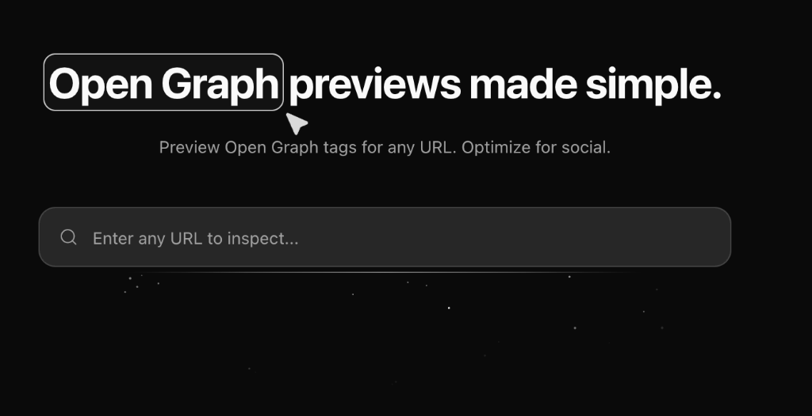

# MetaCheck

**MetaCheck** is a modern, developer-friendly tool for previewing and analyzing Open Graph meta tags. Ensure your content looks perfect across social media platforms with real-time previews and actionable SEO insights.



## ✨ Features

- **Multi-Platform Previews**: Instantly see how your URL appears on Facebook, X (Twitter), LinkedIn, WhatsApp, and Discord.
- **Real-time Analysis**: Fetch and parse meta tags, Open Graph data, and Twitter Cards from any live URL.
- **Smart Recommendations**: Get actionable suggestions to improve your SEO and social visibility (missing tags, optimal lengths, technical checks).
- **Modern UI/UX**: Built with a sleek, monochrome aesthetic inspired by top-tier developer tools.
- **Dark Mode**: Fully supported dark mode interface.

## 🛠️ Tech Stack

- **Framework**: React 19 + Vite
- **Styling**: Tailwind CSS v4
- **UI Components**: Shadcn UI, Aceternity UI, Lucide React
- **Animation**: Framer Motion
- **State Management**: TanStack Query
- **Utilities**: Custom parser with CORS proxy support

## 🚀 Getting Started

1. **Clone the repository**
   ```bash
   git clone https://github.com/TirthDhandhukia30/metacheck.git
   cd metacheck
   ```

2. **Install dependencies**
   ```bash
   npm install
   # or
   bun install
   ```

3. **Start the development server**
   ```bash
   npm run dev
   # or
   bun run dev
   ```

4. Open [http://localhost:5173](http://localhost:5173) in your browser.

## 🤝 Contributing

Contributions are welcome! Please feel free to submit a Pull Request.

## 📄 License

This project is open source and available under the [MIT License](LICENSE).

---

Made with ❤️ by [Tirth Dhandhukia](https://tirthdhandhukia.com)
